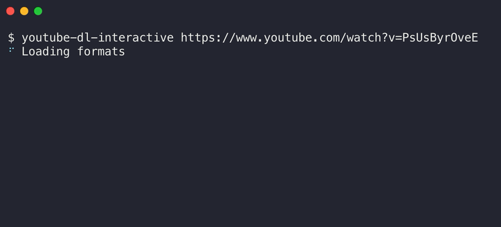

> Interactively select the quality and format for youtube-dl.

A [youtube-dl](https://github.com/ytdl-org/youtube-dl) wrapper, which helps you to download a specific format. 

	 
	

		
	

# Why?
Because remembering CLI flags is hard.  

# Installation

Make sure you have [youtube-dl](https://github.com/ytdl-org/youtube-dl) installed. And [Node](https://nodejs.org) >= 8. 

    $ npm install -g youtube-dl-interactive

# Usage

    $ youtube-dl-interactive URL

# Note 

> This is alpha version, use it at your own risks! 😱
> Thanks in advance for reporting bugs. #sharethelove 😊

Only tested on macOS so far. 
